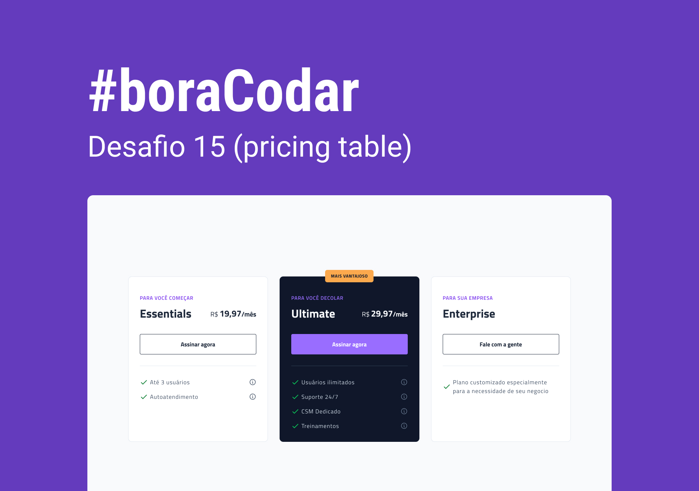

<h1 align="center"> Pricing Table </h1>

Projeto desenvolvido utilizando um layout disponibilizado pelo  Jonas Milan e a Rocketseat através do #boraCodar  

  <a href="#-tecnologias">Tecnologias</a>&nbsp;&nbsp;&nbsp;|&nbsp;&nbsp;&nbsp;
  <a href="#-projeto">Projeto</a>&nbsp;&nbsp;&nbsp;|&nbsp;&nbsp;&nbsp;
  <a href="#-layout">Layout</a>&nbsp;&nbsp;&nbsp;|&nbsp;&nbsp;&nbsp;
  

 

  

## 🚀 Tecnologias

Esse projeto foi desenvolvido utilizando:

- HTML e CSS
- Git e Github
- Figma

## 💻 Sobre o projeto

O projeto simula algumas tabelas de preços dos planos mensais de uma empresa.

- [Você pode acessar o projeto clicando aqui](https://hecro.github.io/price-table/) ou clicando no link no topo desse mesmo repositório.

## 🔖 Layout

Você pode visualizar o layout do projeto [clicando aqui](https://www.figma.com/community/file/1227809985897425342). Você vai precisar de uma conta no [Figma](https://figma.com) para acessar.

---

Feito com ♥ by Lucas Hecro